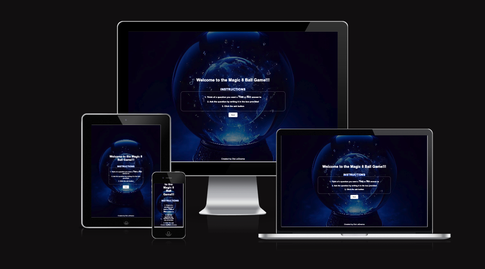
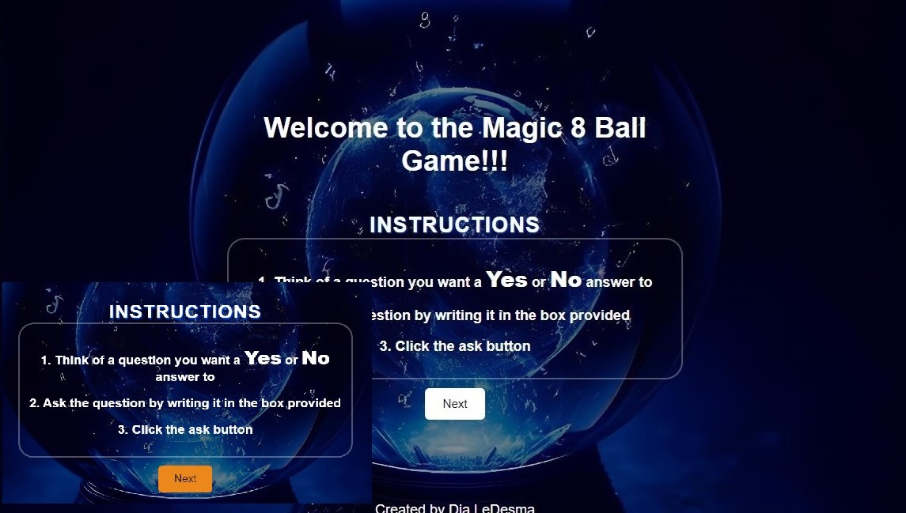
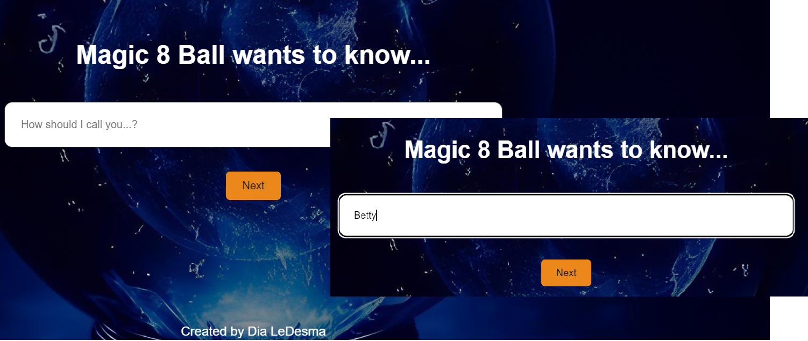
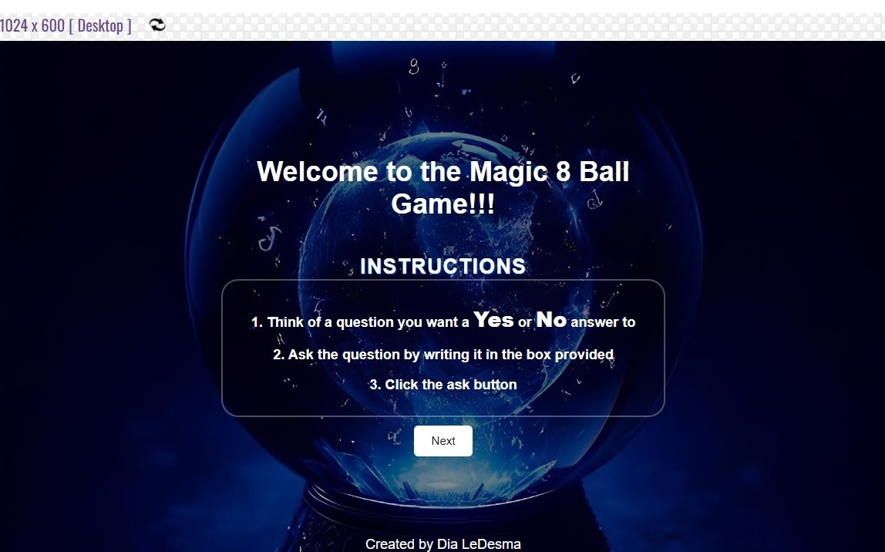

## Second project PP2_8_ball_game

# Magic_8_ball Game
<b> Link to deployed game <b>: https://diasdevils.github.io/magic_8_ball/

The 8 ball game is an entertainment website. 
It is there as a passtime game, timewaster game to ask a yes or no question and receive a yes or no answer.

# Design 
My design of this game really stems from my interest in fortune telling. It paves the way for designing a more complex website of tarot card reading in future. The background is very suiting of a crystal ball in a dark and mystic background.  The game of the 8 ball is world famous as well. It is entertaining and there are crowds that love fortune telling. The font I just kept the default. I personally like the simple look default look.

# Features
1. It has a welcome section.

The welcome section gives insturctions in case someone is unfamiliar with the Magic 8 ball game. Then once the user presses the next button it moves along to the next section. 

2. An input name section.

This second section asks the user to input their name. This feature makes the game more personalised for a warmer experience. It also validates there is a name provided so it does expect a user input.

3. And lastly the game section.

The game section gives cute sassy answers by referencing the user name previously given.
It validates when the user inputs a question. If no question is written in the box, it does ask for an input, otherwise no answer is given. The game serves the purpose of entertainment. 

## Look in Computer Size

Since the game actually looked ok on all devices when resizing no media queries were needed.

## Look in Notepad Size

## Look in Mobile Size

# Testing

1. The testing of HTML has been done using the validator.

2. The testing of CSS has also been done using the validator.

3. The testing of accessibility.

4. The testing of javascript through validator.

5. I also visted the webiste from my phone and my mothers phone. I requested friends to visit the site and play with it to manually test and have some users actually play the game.

# Bugs
There were several bugs.

1- The ask button just worked on its own.
   **Issue**: The user did not have to initialy write a question. 
   **Cause**: If the ask button was clicked answers were provided without a qustion input.
   **Resolution**: Made a validation that checked for input. If input empty, an error message shows, otherwise the game continues.

2- The second bug was encounterd when I was trying to hide the sections so that it would move swiftly along to the next section i.e. from welcome to name to game sections.
    **Issue**: The next button was not working. 
    **Cause**: I had named the container the same instead of the next container name so that it would move to the next section.
   **Resolution**: Renamed the container name instead of welcome.

3- Lastly, the warnings for javascript, where it appeared that the code was not accessible for all the es versions as per javascript validator. 
   **Issue**: Code not runable on old versions.
   **Cause**: Incompatability and updates.
   **Resolution**: Clicked on diganostic and enabled for runability on older versions.

# Future Features
In future I would probably make this website better by actually adding an animdated 8 ball. I would also wish to add statistics for viewers like for example how many people have visted the site or how many people have asked a question or how many times a question has been asked. Perhaps even develop the site to have several games as well like yes or no with dice OR a yes or no with a flip of a coin as well OR a yes or no with matches. It would be great to have several games in several pages all to do with yes or no questions so that people could choose the one they like best.

# References
* Smiley Face https://favicon.io/emoji-favicons/winking-face/
* Eight Ball https://icons8.com/icons/set/eight-ball
* Image of the magic ball was created by Kelsy DeCosta using Microsoft Sweeftkey AI.
* Validator HTML https://jigsaw.w3.org/css-validator/validator
* Validator CSS https://validator.w3.org/

## Huge thank you to my Jedi mentor Richard Wells.
Enhancement ideas and code suggestions by Richard Wells, particularly thankful for the guidance in the Welcome and Username Sections.
Other sections of code come from open source or code how to googling and
W3Schools at link: https://www.w3schools.com/ .

Thank you.
