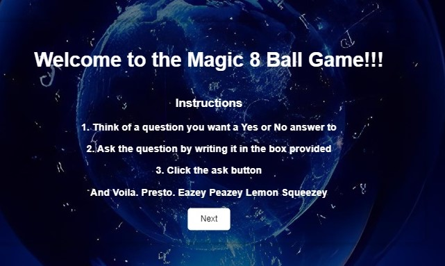
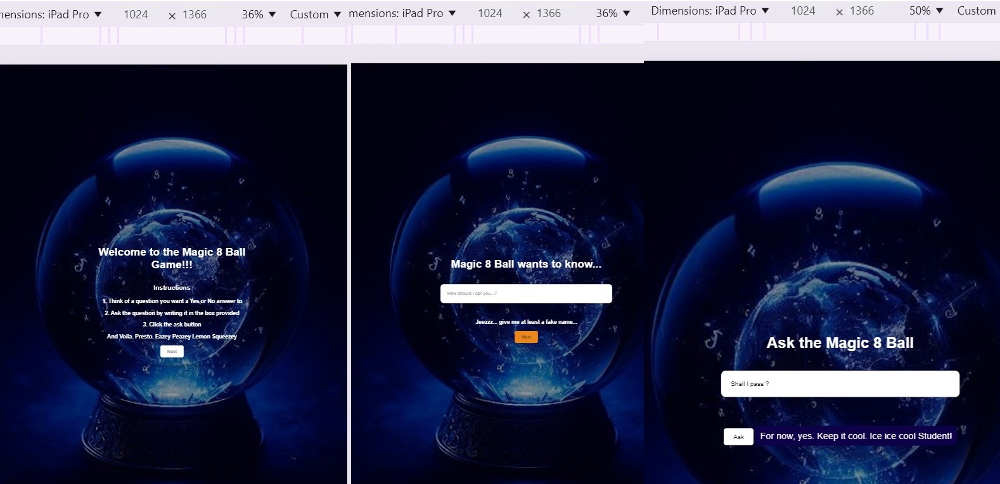
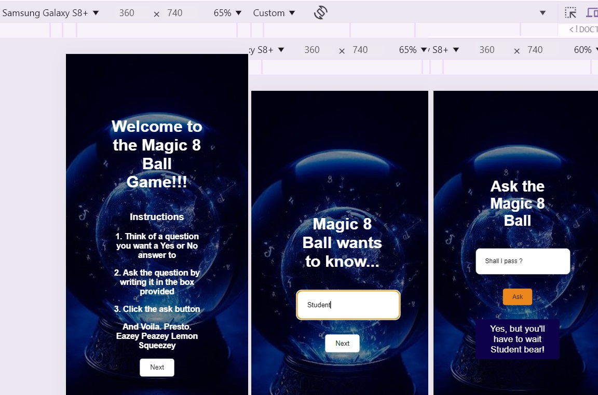
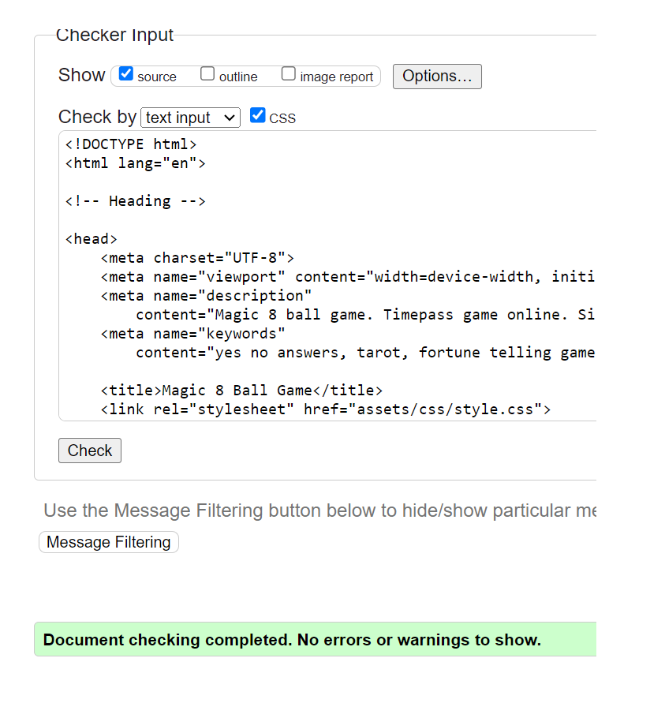
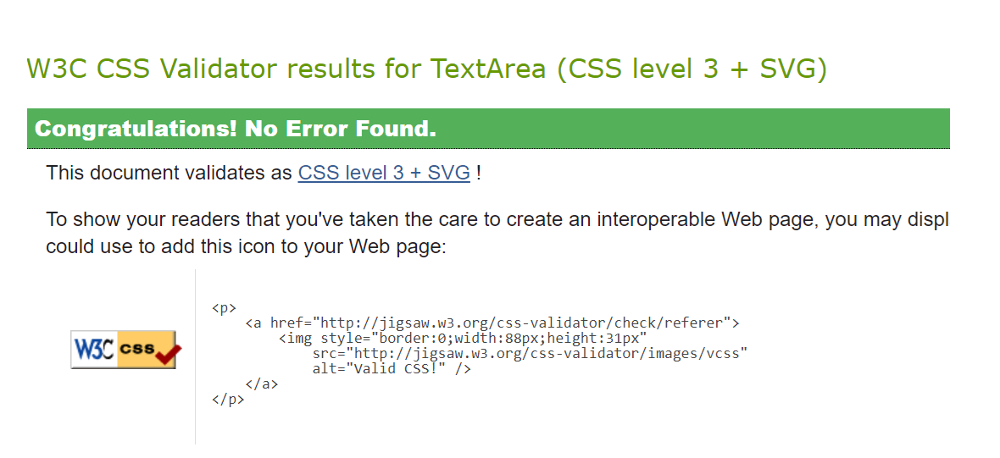

## Second project PP2_8_ball_game

# Magic_8_ball Game
<b> Link to deployed game <b>: https://diasdevils.github.io/magic_8_ball/

The 8 ball game is an entertainment website. 
It is there as a passtime game to ask a yes or no question and receive a yes or no answer.

# Features
1. It has a weclome section.

The welcome section gives insturctions in case someone is unfamiliar with the Magic 8 ball game. Then once the user presses the next button it moves along to the next section. 

2. An input name section.

This second section asks the user to input their name. This feature makes the game more personalised for a warmer experience. It also validates there is a name provided so it does expect a user input.

3. And lastly the game section.

The game section gives cute sassy answers by referencing the user name previously given.
It validates when the user inputs a question. If no question is written in the box, it does ask for an input, otherwise no answer is given. The game serves the purpose of entertainment. 

## Look in Computer Size

Since the game actually looked ok on all devices when resizing no media queries were needed.

## Look in Notepad Size

## Look in Mobile Size

# Testing

The testing of HTML has been done using the validator.

The testing of CSS has also been done using the validator.

# Bugs
There were several bugs.
One the user did not have to initialy write a question. If the ask button was clicked answers were provided without a qustion input.
The other bug was encounterd when i was trying to hide the sections so that it would move swiftly along to the next section i.e. from welcome to name to game sections. The next button was not working. The issue was I had named the container the same instead of the next container name so that it would move to the next section.

# References
* Smiley Face https://favicon.io/emoji-favicons/winking-face/
* Eight Ball https://icons8.com/icons/set/eight-ball
* Image of the magic ball was created by Kelsy DeCosta using Microsoft Sweeftkey AI.

## Huge thank you to my Jedi mentor Richard Wells.
Code ideas and suggestions by Richard Wells, particularly Welcome and Username Sections.
Also, other sections of code were open source code googling.
